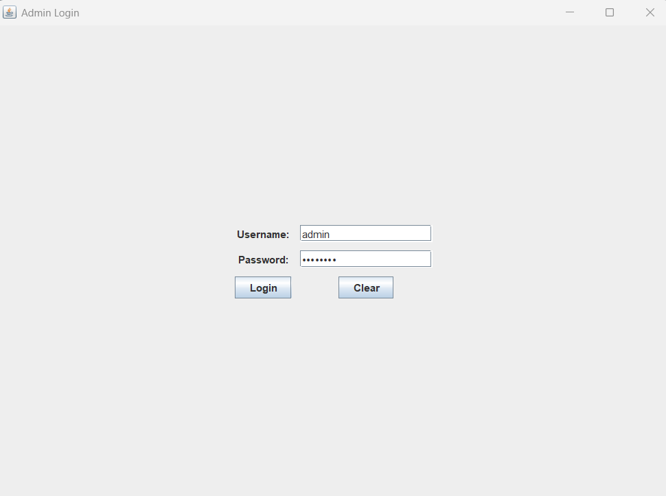
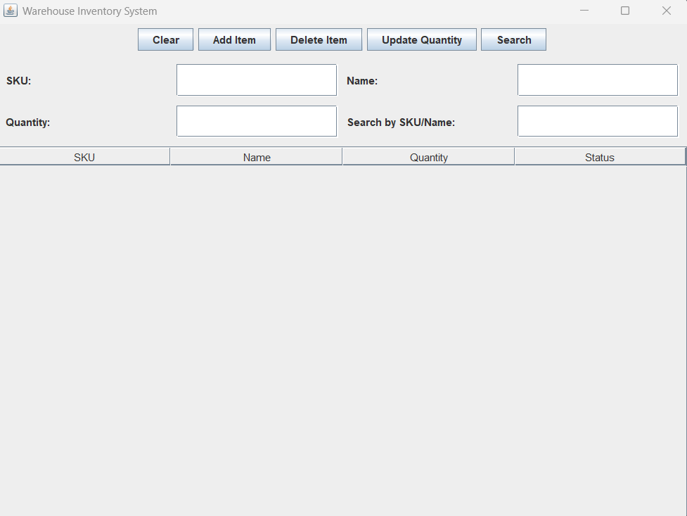

# 📦 Inventory Management System – Mini Project

A basic Inventory Management System developed using Java and Swing. This project provides a simple graphical interface for managing product inventory, including features such as adding, updating, and deleting items.

## 🚀 Features

- 🔐 Admin login authentication  
- 🖥️ User-friendly GUI using Java Swing  
- ➕ Add, 📝 Edit, and ❌ Delete inventory items  
- 📊 Display item details: ID, name, quantity, price  

## 🛠️ Technologies Used

- **Programming Language**: Java  
- **GUI Framework**: Swing (Java AWT/Swing)  
- **Development Environment**: Any Java IDE (e.g., Eclipse, IntelliJ)  
- **Compilation**: Java `.class` files included for easy execution  

## 🧮 Data Structures Used

- **ArrayList** – used to dynamically store and manage inventory items  

- **Custom Classes**:
  - `Item`: Represents an individual inventory item
  - `Inventory`: Manages the collection of items
  - `InventoryGUI`: Provides the graphical user interface
  - `AdminLogin`: Handles login logic
  - `Main`: Entry point to launch the application

---

## 📷 Screenshots

### 🔐 Admin Login Screen

### 📦 Inventory Management GUI

